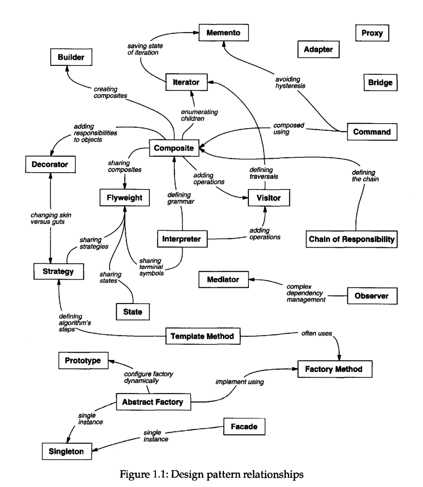

# Design Patterns

This repository implements in Java each of the design patterns explained 
in the book "Design Patterns: Elements of Reusable Object-Oriented Software" 
(known as GOF), written by Erich Gamma, Richard Helm, Ralph Johnson and 
John Vlissides.

## About the book

The book isn't an introduction to object-oriented technology or design. Many books
already do a good job of that. The book assumes you are reasonably proficient in at least
one object-oriented programming language, and you should have some experience in
object-oriented design as well. You definitely shouldn't have to rush to the nearest
dictionary the moment we mention "types" and "polymorphism," or "interface" as
opposed to "implementation" inheritance.

On the other hand, this isn't an advanced technical treatise either. It's a book of design
patterns that describes simple and elegant solutions to specific problems in object-oriented 
software design. Design patterns capture solutions that have developed and
evolved over time.Hence they aren't the designs people tend to generate initially.They
reflect untold redesign and receding as developers have struggled for greater reuse
and flexibility in their software. Design patterns capture these solutions in a succinct
and easily applied form.

## Introduction

Designing object-oriented software is hard, and designing reusable object-oriented software 
is even harder. You must find pertinent objects, factor them into classes at the
right granularity, define class interfaces and inheritance hierarchies, and establish key
relationships among them. Your design should be specific to the problem at hand but
also general enough to address future problems and requirements. You also want to
avoid redesign, or at least minimize it. Experienced object-oriented designers will tell
you that a reusable and flexible design is difficult if not impossible to get "right" the first
time. Before a design is finished, they usually try to reuse it several times, modifying it
each time.

Yet experienced object-oriented designers do make good designs. Meanwhile new
designers are overwhelmed by the options available and tend to fall back on non-
object-oriented techniques they've used before. It takes a long time for novices to learn
what good object-oriented design is all about. Experienced designers evidently know
something inexperienced ones don't. What is it?

One thing expert designers know not to do is solve every problem from first principles.
Rather, they reuse solutions that have worked for them in the past. When they find a
good solution, they use it again and again. Such experience is part of what makes them
experts. Consequently, you'll find recurring patterns of classes and communicating
objects in many object-oriented systems.These pattern solve specific design problems
and make object-oriented designs more flexible,elegant, and ultimately reusable. They
help designers reuse successful designs by basing new designs on prior experience.
A designer who is familiar with such patterns can apply them immediately to design
problems without having to rediscover them.

An analogy will help illustrate the point. Novelists and playwrights rarely design
their plots from scratch. Instead, they follow patterns like "Tragically Flawed Hero"
(Macbeth, Hamlet, etc.) or "The RomanticNovel" (countless romance novels). In the
same way, object-oriented designers follow patterns like "represent states with objects"
and "decorate objects so you can easily add/remove features." Once you know the
pattern, a lot of design decisions follow automatically.

We all know the value of design experience. How many times have you had design deja-vu 
that feeling that you've solved a problem before but not knowing exactly where or
how? If you could remember the details of the previous problem and how you solved
it, then you could reuse the experience instead of rediscovering it. However, we don't
do a good job of recording experience in software design for others to use.

The purpose of this book isto record experience in designing object-oriented software as
design patterns. Each design pattern systematically names, explains, and evaluates an
important and recurring design in object-oriented systems. Our goal isto capture design
experience in a form that people can use effectively. To this end we have documented
some of the most important design patterns and present them as a catalog.

Design patterns make it easier to reuse successful designs and architectures. Expressing
proven techniques as design patterns makes them more accessible to developers of
new systems. Design patterns help you choose design alternatives that make a system
reusable and avoid alternatives that compromise reusability. Design patterns can even
improve the documentation and maintenance of existing systems by furnishing an
explicit specification of class and object interactions and their underlying intent. Put
simply, design patterns help a designer get a design "right" faster.

None of the design patterns in this book describes new or unproven designs. We have
included only designs that have been applied more than once in different systems.Most
of these designs have never been documented before. They are either part of the folklore
of the object-oriented community or are elements of some successful object-oriented
systems—neither of which is easy for novice designers to learn from. So although these
designs aren't new,we capture them in a new and accessible way: as a catalog of design
patterns having a consistent format.

Despite the book's size, the design patterns in it capture only a fraction of what an expert
might know.It doesn't have any patterns dealing with concurrency or distributed programming
or real-time programming. It doesn't have any application domain-specific
patterns. It doesn't tell you how to build user interfaces, how to write device drivers,
or how to use an object-oriented database. Each of these areas has its own patterns, and
it would be worthwhile for someone to catalog those too.

## What Is a Design Pattern?

Christopher Alexander says, "Each pattern describes a problem which occurs over and
over again in our environment, and then describes the core of the solution to that
problem, in such a way that you can use this solution a million times over, without ever
doing it the same way twice" [AIS+77, page x}. Even though Alexander was talking
about patterns in buildings and towns, what he says is true about object-oriented design
patterns. Our solutions are expressed in terms of objects and interfaces instead of walls
and doors, but at the core of both kinds of patterns is a solution to a problem in a
context.

## How Design Patterns Solve Design Problems

Design patterns solve many of the day-to-day problems object-oriented designers face,
and in many different ways.Here are several of these problems and how design patterns
solve them.

#### Finding Appropriate Objects

Object-oriented programs are made up of objects. An object packages both data and
the procedures that operate on that data. The procedures are typically called methods
or operations. An object performs an operation when it receives a request (o rmessage)
from a client.

Requests are the only way to get an object to execute an operation. Operations are
the only way to change an object's internal data. Because of these restrictions, the
object's internal state is said to be encapsulated; it cannot be accessed directly, and its
representation is invisible from outside the object.

The hard part about object-oriented design is decomposing a system into objects.The
task is difficult because many factors come into play: encapsulation, granularity, dependency,
flexibility, performance, evolution, reusability, and on and on. They all influence
the decomposition, often in conflicting ways.

Object-oriented design methodologies favor many different approaches. You can write
a problem statement, single out the nouns and verbs, and create corresponding classes
and operations. Or you can focus on the collaborations and responsibilities in your
system.Or you can model the real world and translate the objects found during analysis
into design. There will always be disagreement on which approach is best.

Many objects in a design come from the analysis model. But object-oriented designs
often end up with classes that have no counterparts in the real world. Some of these are
low-level classes like arrays. Others are much higher-level. For example, the Composite
pattern introduces an abstraction for treating objects uniformly that doesn't
have a physical counterpart. Strict modeling of the real world leads to a system that
reflects today's realities but not necessarily tomorrow's. The abstractions that emerge
during design are key to making a design flexible.

## How to Select a Design Pattern

With more than 20design patterns in the catalog to choose from, it might be hard to find
the one that addresses a particular design problem, especially if the catalog is new and
unfamiliar to you. Here are several different approaches to finding the design pattern
that's right for your problem:

* Consider how design patterns solve design problems. Find appropriate objects, determine 
object granularity, specify object interfaces, and several other ways in which design patterns
solve design problems.
* Scan Intent sections. Read through each pattern's intent to find one or more that sound
relevant to your problem.
* Study how patterns interrelate. The image up shows relationships between
design patterns graphically. Studying these relationships can help direct you to
the right pattern or group of patterns.
* Study patterns of like purpose. The book has three chapters, one for
creational patterns, another for structural patterns, and a third for behavioral
patterns. Each chapter starts off with introductory comments on the patterns and
concludes with a section that compares and contrasts them. These sections give
you insight into the similarities and differences between patterns of like purpose.
* Examine a cause of redesign. Look at the causes of redesign starting on page 24 to
see if your problem involves one or more of them. Then look at the patterns that
help you avoid the causes of redesign.
* Consider what should be variable in your design. This approach is the opposite of
focusing on the causes of redesign. Instead of considering what might force a
change to a design, consider what you want to be able to change without redesign.
The focus here is on encapsulating the concept that varies, a theme of many design
patterns. The book lists the design aspect(s) that design patterns let you vary
independently, thereby letting you change them without redesign.

# Design Pattern Catalog

## Creational Patterns

Creational design patterns abstract the instantiation process. They help make a system
independent of how its objects are created, composed, and represented. A class creational 
pattern uses inheritance to vary the class that's instantiated, whereas an object
creational pattern will delegate instantiation to another object.

Creational patterns become important as systems evolve to depend more on object
composition than class inheritance. As that happens, emphasis shifts away from hardcoding 
a fixed set of behaviors toward defining a smaller set of fundamental behaviors
that can be composed into any number of more complex ones. Thus creating objects
with particular behaviors requires more than simply instantiating a class.

There are two recurring themes in these patterns. First, they all encapsulate knowledge
about which concrete classes the system uses. Second, they hide how instances of these
classes are created and put together. All the system at large knows about the objects is
their interfaces as defined by abstract classes. Consequently, the creational patterns give
you a lot of flexibility in what gets created, who creates it, how it gets created, and when.
They let you configure a system with "product" objects that vary widely in structure
and functionality. Configuration can be static (that is, specified at compile-time) or
dynamic (atrun-time).

 * Abstract Factory
 * [Builder](./builder/README.md)
 * [Factory Method](./factory-method/README.md)
 * [Prototype](./prototype/README.md)
 * [Singleton](./singleton/README.md)

## Structural Patterns

Structural patterns are concerned with how classes and objects are composed to form
larger structures. Structural class patterns use inheritance to compose interfaces or 
implementations. As a simple example, consider how multiple inheritance mixes two or
more classes into one. The result is a class that combines the properties of its parent
classes. This pattern is particularly useful for making independently developed class
libraries work together. Another example is the class form of the Adapter (139) pat-
tern. In general, an adapter makes one interface (the adaptee's) conform to another,
thereby providing a uniform abstraction of different interfaces.A class adapter accomplishes 
this by inheriting privately from an adaptee class. The adapter then expresses
its interface in terms of the adaptee's.

Rather than composing interfaces or implementations, structural object patterns 
describe ways to compose objects to realize new functionality. The added flexibility of
object composition comes from the ability to change the composition at run-time, which
is impossible with static class composition.

 * [Adapter](./adapter/README.md)
 * Bridge
 * Composite
 * [Decorator](./decorator/README.md)
 * [Facade](./facade/README.md)
 * Flyweight
 * Proxy

## Behavioral Patterns

Behavioral patterns are concerned with algorithms and the assignment of responsibilities 
between objects. Behavioral patterns describe not just patterns of objects or classes
but also the patterns of communication between them. These patterns characterize
complex control flow that's difficult to follow at run-time. They shift your focus away
from flow of control to let you concentrate just on the way objects are interconnected.

Behavioral class patterns use inheritance to distribute behavior between classes. This
chapter includes two such patterns. Template Method is the simpler and more
common of the two. A template method is an abstract definition of an algorithm. It
defines the algorithm step by step. Each step invokes either an abstract operation or
a primitive operation. A subclass fleshes out the algorithm by defining the abstract
operations. The other behavioral class pattern is Interpreter, which represents
a grammar as a class hierarchy and implements an interpreter as an operation on
instances of these classes.

 * Chain of Responsibility
 * [Command](./command/README.md)
 * Interpreter
 * [Iterator](./iterator/README.md)
 * Mediator
 * Memento
 * Observer
 * State
 * [Strategy](./strategy/README.md)
 * [Template Method](./template-method/README.md)
 * Visitor