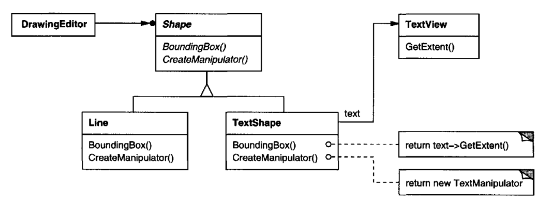
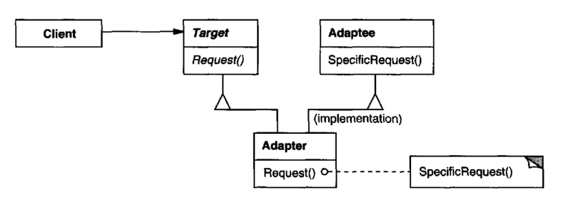
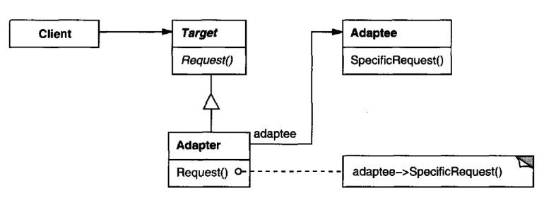

# Adapter

## Intent

Convert the interface of a class into another interface clients expect. Adapter lets
classes work together that couldn't otherwise because of incompatible interfaces.

## Also Known As
Wrapper

## Motivation

Sometimes a toolkit class that's designed for reuse isn't reusable only because its
interface doesn't match the domain-specific interface an application requires.
Consider for example a drawing editor that lets users draw and arrange graphical
elements (lines, polygons, text, etc.) into pictures and diagrams. The drawing
editor's key abstraction is the graphical object, which has an editable shape and
can draw itself. The interface for graphical objects is defined by an abstract class
called Shape. The editor defines a subclass of Shape for each kind of graphical
object: a LineShape class for lines, a PolygonShape class for polygons, and so
forth.

Classes for elementary geometric shapes like LineShape and PolygonShape are
rather easy to implement, because their drawing and editing capabilities are
inherently limited. But a TextShape subclass that can display and edit text is
considerably more difficult to implement, since even basic text editing involves
complicated screen update and buffer management. Meanwhile, an off-the-shelf
user interface toolkit might already provide a sophisticated TextView class for
displaying and editing text. Ideally we'd like to reuse TextView to implement
TextShape, but the toolkit wasn't designed with Shape classes in mind. So we
can't use TextView and Shape objects interchangeably.

How can existing and unrelated classes like TextView work in an application that
expects classes with a different and incompatible interface? We could change the
TextView class so that it conforms to the Shape interface, but that isn't an option
unless we have the toolkit's source code. Even if we did, it wouldn't make sense to
change TextView; the toolkit shouldn't have to adopt domain-specific interfaces
just to make one application work.

Instead, we could define TextShape so that it adapts the TextView interface to
Shape's. We can do this in one of two ways: (1) by inheriting Shape's interface
and TextView's implementation or (2)by composing a TextView instance within
a TextShape and implementing TextShape in terms of Text View's interface. These
two approaches correspond to the class and object versions of the Adapter pattern.
We call TextShape an adapter.

This diagram illustrates the object adapter case. It shows how BoundingBox 
requests, declared in class Shape, are converted to GetExtent requests defined in
TextView. Since TextShape adapts TextView to the Shape interface, the drawing
editor can reuse the otherwise incompatible TextView class.

Often the adapter is responsible for functionality the adapted class doesn't 
provide. The diagram shows how an adapter can fulfill such responsibilities. The
user should be able to "drag" every Shape object to a new location interactively,
but TextView isn't designed to do that. TextShape can add this missing functionality 
by implementing Shape's CreateManipulator operation, which returns an
instance of the appropriate Manipulator subclass.

Manipulator is an abstract class for objects that know how to animate a Shape in
response to user input, like dragging the shape to a new location. There are 
subclasses of Manipulator for different shapes; TextManipulator,for example, is the
corresponding subclass for TextShape.By returning a TextManipulator instance,
TextShape adds the functionality that Text View lacks but Shape requires.

## Applicability

Use the Adapter pattern when
* you want to use an existing class, and its interface does not match the one
you need.
* you want to create a reusable class that cooperates with unrelated or unforeseen 
classes, that is, classes that don't necessarily have compatible interfaces.
* (object adapter only) you need to use several existing subclasses, but it's 
unpractical to adapt their interface by subclassing every one. An object adapter
can adapt the interface of its parent class.

## Structure

A class adapter uses multiple inheritance to adapt one interface to another:

An object adapter relies on object composition:

