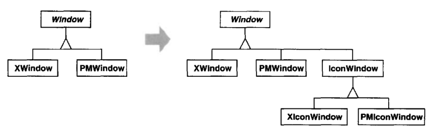
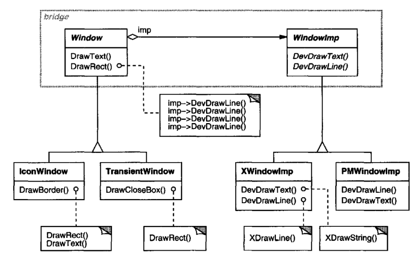
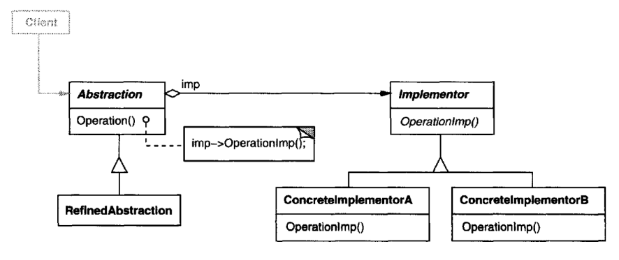

# Bridge

## Intent

Decouple an abstraction from its implementation so that the two can vary independently.

## Also Known As

Handle/Body

## Motivation

When an abstraction can have one of several possible implementations, the usual
way to accommodate them is to use inheritance. An abstract class defines the interface 
to the abstraction, and concrete subclasses implement it in different ways.
But this approach isn't always flexible enough. Inheritance binds an 
implementation to the abstraction permanently, which makes it difficult to modify, extend,
and reuse abstractions and implementations independently.

Consider the implementation of a portable Window abstraction in a user interface
toolkit. This abstraction should enable us to write applications that work on both
the XWindow System and IBM'sPresentation Manager (PM), for example. Using
inheritance, we could define an abstract class Window and subclasses XWindow
and PMWindow that implement the Window interface for the different platforms.
But this approach has two drawbacks:
1. It's inconvenient to extend the Window abstraction to cover different kinds
   of windows or new platforms.Imagine an IconWindow subclass ofWindow
   that specializes the Window abstraction for icons. Tosupport IconWindows
   for both platforms, we have to implement two new classes, XlconWindow
   and PMIconWindow. Worse, we'll have to define two classes for every kind
   of window. Supporting a third platform requires yet another new Window
   subclass for every kind of window.

2. It makes client code platform-dependent. Whenever a client creates a window, 
   it instantiates a concrete class that has a specific implementation. For
   example, creating an XWindow object binds the Window abstraction to the
   X Window implementation, which makes the client code dependent on the
   X Window implementation. This, in turn, makes it harder to port the client
   code to other platforms.

    Clients should be able to create a window without committing to a concrete 
    implementation. Only the window implementation should depend on
    the platform on which the application runs. Therefore client code should
    instantiate windows without mentioning specific platforms.

The Bridge pattern addresses these problems by putting the Window abstraction
and its implementation in separate class hierarchies. There is one class hierarchy
for window interfaces(Window,IconWindow, TransientWindow) and a separate
hierarchy for platform-specific window implementations, with Window lmp as its
root. TheXWindowImp subclass, for example, provides an implementation based
on the X Window System.

All operations on Window subclasses are implemented in terms of abstract operations 
from the Window lmp interface. This decouples the window abstractions
from the various platform-specific implementations. We refer to the relationship
between Window and Window lmp as a bridge,because it bridges the abstraction
and its implementation, letting them vary independently.

## Applicability

Use the Bridge pattern when

* you want to avoid a permanent binding between an abstraction and its 
implementation. This might be the case,for example,when the implementation
must be selected or switched at run-time.
* both the abstractions and their implementations should be extensible by
subclassing. In this case, the Bridge pattern lets you combine the different
abstractions and implementations and extend them independently.
* changes in the implementation of an abstraction should have no impact on
clients; that is, their code should not have to be recompiled.
* (C++) you want to hide the implementation of an abstraction completely from
clients. In C++ the representation of a class is visible in the class interface.
* you have a proliferation of classes as shown earlier in the first Motivation
diagram. Such a class hierarchy indicates the need for splitting an object into
two parts. Rumbaugh uses the term "nested generalizations" [RBP+91] to
refer to such class hierarchies.
* you want to share an implementation among multiple objects(perhaps using
reference counting), and this fact should be hidden from the client.A simple
example is Coplien's String class [Cop92], in which multiple objects can share
the same string representation (StringRep).

## Structure

