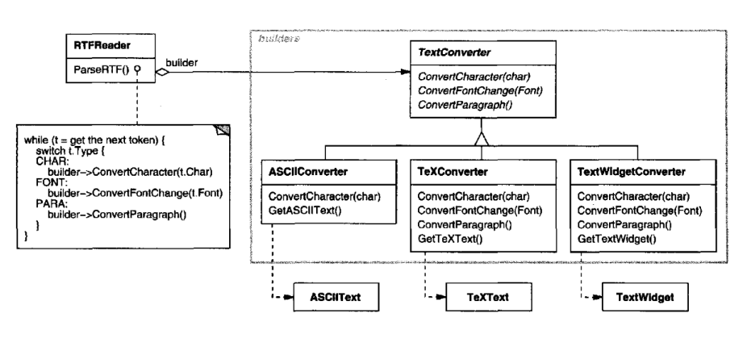
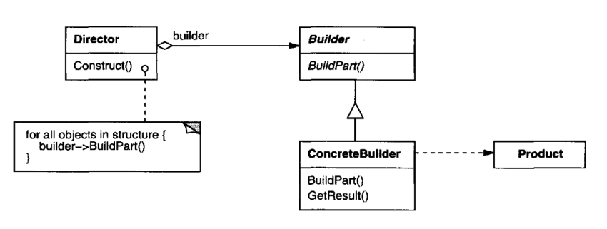

# Builder

## Intent

Separate the construction of a complex object from its representation so that the
same construction process can create different representations.

## Motivation

A reader for the RTF(Rich Text Format)document exchange format should be able
to convert RTFto many text formats.The reader might convert RTF documents
into plain ASCII text or into a text widget that can be edited interactively. The
problem, however, is that the number of possible conversions is open-ended. So
it should be easy to add a new conversion without modifying the reader.

A solution is to configure the RTFReader class with a TextConverter object that
converts RTF to another textual representation. As the RTFReader parses theRTF
document, it uses the TextConverter to perform the conversion. Whenever the
RTFReader recognizes an RTFtoken (either plain text or an RTFcontrol word), it
issues a request to the TextConverter to convert the token. TextConverterobjects
are responsible both for performing the data conversion and for representing the
token in a particular format.

Subclasses of TextConverter specialize in different conversions and formats.For
example, an ASCIIConverter ignores requests to convert anything except plain
text.ATeXConverter, on the other hand, will implement operations for all requests
in order to produce a Tp^X representation that captures all the stylistic information
in the text. A TextWidgetConverter will produce a complex user interfaceobject
that lets the user see and edit the text.

Each kind of converter class takes the mechanism for creating and assembling a
complex object and puts it behind an abstract interface.The converter is separate
from the reader, which is responsible for parsing an RTFdocument.

The Builder pattern captures all these relationships. Each converter class is called
a builder in the pattern, and the reader is called the director. Applied to this
example, the Builder pattern separates the algorithm for interpreting a textual
format (that is, the parser for RTFdocuments) from how a converted format gets
created and represented. This lets us reuse the RTFReader's parsing algorithm
to create different text representations from RTFdocuments—just configure the
RTFReader with different subclasses of TextConverter.

## Applicability

Use the Builder pattern when
 * the algorithm for creating a complex object should be independent of the
parts that make up the object and how they're assembled.
 * the construction process must allow different representations for the object
that's constructed.

## Structure

