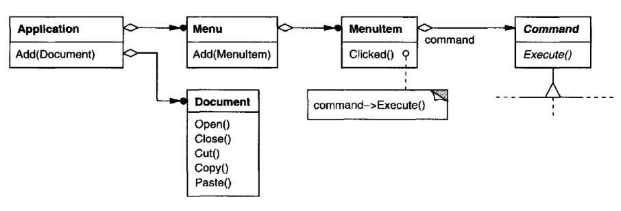
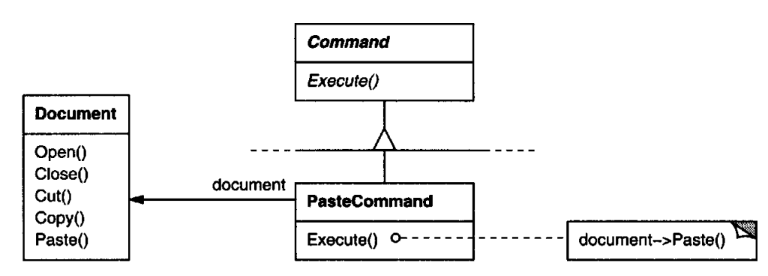
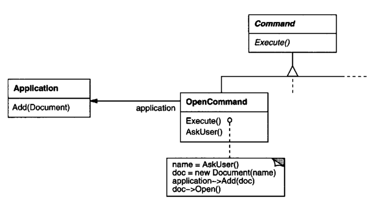
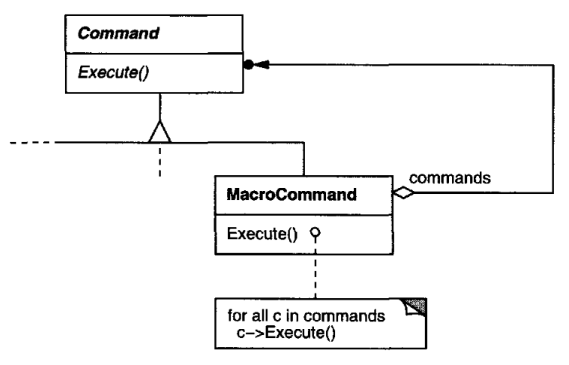
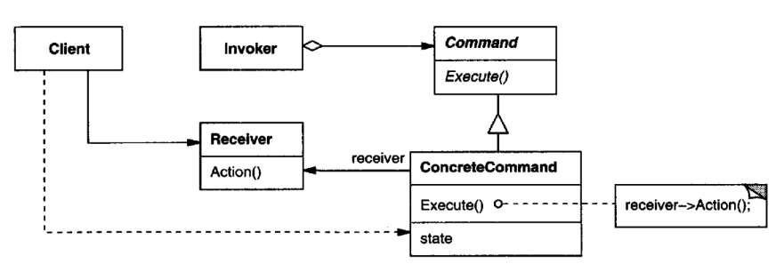

# Command

## Intent

Encapsulate a request as an object, thereby letting you parameterize clients with
different requests, queue or log requests, and support undoable operations.

## Also Known As

Action, Transaction

## Motivation

Sometimes it's necessary to issue requests to objects without knowing anything
about the operation being requested or the receiver of the request. For example,
user interface toolkits include objects like buttons and menus that carry out a
request in response to user input. But the toolkit can't implement the request
explicitly in the button or menu, because only applications that use the toolkit
know what should be done on which object. Astoolkit designers we have no way
of knowing the receiver of the request or the operations that will carry it out.

The Command pattern lets toolkit objects make requests of unspecified applica-
tion objects by turning the request itself into an object. This object can be stored

and passed around like other objects.The key to this pattern is an abstract Com-
mand class, which declares an interface for executing operations. In the simplest

form this interface includes an abstract Execute operation. Concrete Command
subclasses specify a receiver-action pair by storing the receiver as an instance
variable and by implementing Execute to invoke the request. The receiver has the
knowledge required to carry out the request.

Menus can be implemented easily with Command objects. Each choice in a Menu
is an instance of a Menultem class. An Application class creates these menus and
their menu items along with the rest of the user interface. The Application class
also keeps track of Document objects that a user has opened.

The application configures each Menultem with an instance of a concrete Com-
mand subclass. When the user selects a Menultem, the Menultem calls Execute

on its command, and Execute carries out the operation. Menultems don't know
which subclass ofCommand they use. Command subclasses store the receiver of
the request and invoke one or more operations on the receiver.
For example, PasteCommand supports pasting text from the clipboard into a
Document. PasteCommand'sreceiver is the Document object it is supplied upon
instantiation. The Execute operation invokes Paste on the receiving Document.

OpenCommand's Execute operation is different: it prompts the user for a docu-
ment name, creates a corresponding Document object, adds the document to the
receiving application, and opens the document.

Sometimes a Menultem needs to execute a sequence of commands. For example, a
Menultem for centering a page at normal size could be constructed from a Cen-
terDocumentCommand object and a NormalSizeCommand object. Because it's
common to string commands together in this way, we can define a MacroCom-
mand class to allow a Menultem to execute an open-ended number of commands.

MacroCommand is a concreteCommand subclassthat simply executes a sequence
of Commands. MacroCommandhas no explicit receiver, because the commands
it sequences define their own receiver.

In each ofthese examples, notice how the Command pattern decouplesthe object
that invokesthe operation from the one having the knowledge to perform it. This
gives us a lot of flexibility in designing our user interface. An application can
provide both a menu and a push button interface to a feature just by making
the menu and the push button share an instance of the same concrete Command
subclass. We can replace commands dynamically, which would be useful for
implementing context-sensitive menus. Wecan also support command scripting
by composing commands into larger ones.All ofthisis possible because the object
that issues a request only needs to know how to issue it; it doesn't need to know
how the request will be carried out.

## Applicability

Use the Command pattern when you want to
 * parameterize objects by an actiontoperform, asMenultem objects did above.
You can express such parameterization in a procedural language with a
callback function, that is, a function that's registered somewhere to be called
at a later point. Commands are an object-oriented replacement for callbacks.
 * specify, queue, and execute requests at different times. A Command object
can have a lifetime independent of the original request. If the receiver of a
request can be represented in an address space-independent way, then you
can transfer a command object for the request to a different process and fulfill
the request there.
 * support undo. TheCommand's Execute operation can store state for revers-
ing its effects in the command itself. The Command interface must have an
added Unexecute operation that reverses the effects of a previous call to Ex-
ecute. Executedcommands are stored in a history list. Unlimited-level undo
and redo is achieved by traversing this list backwards and forwards calling
Unexecute and Execute,respectively.
 * support logging changes so that they can be reapplied in case of a system
crash. By augmenting the Command interface with load and store opera-
tions, you can keep a persistent log of changes. Recovering from a crash
involves reloading logged commands from disk and reexecuting them with
the Execute operation.
 * structure a system around high-level operations built on primitives opera-
tions. Such a structure is common in informationsystems that support trans-
actions. A transaction encapsulates a set of changes to data. The Command
pattern offers a way to model transactions. Commands have a common in-
terface, letting you invoke all transactions the same way. The pattern also
makes it easy to extend the system with new transactions.

## Structure

