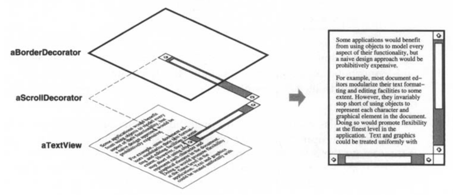
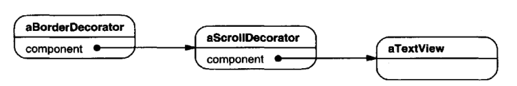
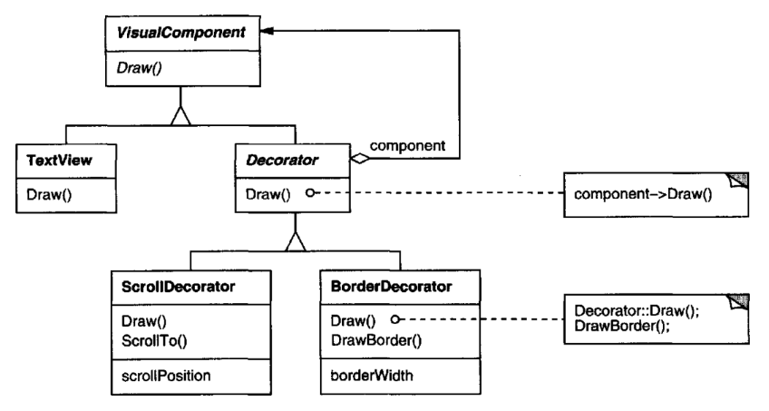
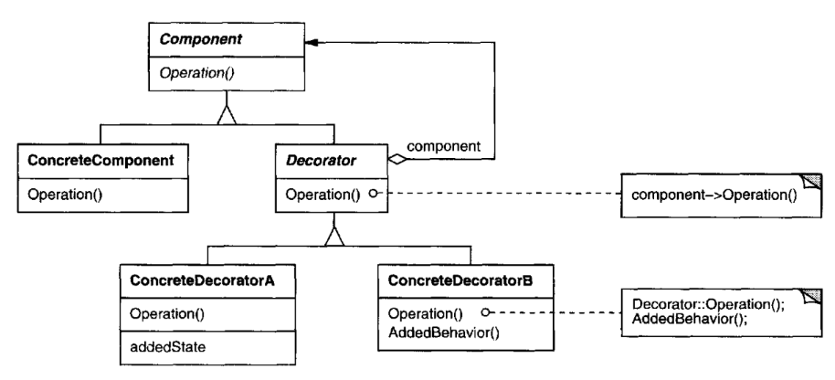

# Decorator

## Intent

Attach additional responsibilities to an object dynamically. Decorators provide a
flexible alternative to subclassing for extending functionality.

## Also Known As

Wrapper

## Motivation

Sometimes we want to add responsibilities to individual objects, not to an entire
class. A graphical user interface toolkit, for example, should let you add properties
like borders or behaviors like scrolling to any user interface component.
One way to add responsibilities is with inheritance. Inheriting a border from
another class puts a border around every subclass instance. This is inflexible,
however, because the choice of border is made statically. A client can't control
how and when to decorate the component with a border.
A more flexible approach is to enclose the component in another object that adds
the border. The enclosing object is called a decorator. The decorator conforms to
the interface of the component it decorates so that its presence is transparent to the
component's clients. The decorator forwards requests to the component and may
perform additional actions (such as drawing a border) before or after forwarding.
Transparency lets you nest decorators recursively, thereby allowing an unlimited
number of added responsibilities.

For example, suppose we have a TextView object that displays text in a window.
TextView has no scroll bars by default, because we might not always need them.
When we do, we can use a ScrollDecorator to add them. Suppose we also want to
add a thick black border around the TextView. We can use a BorderDecorator to
add this as well. We simply compose the decorators with the TextView to produce
the desired result.
The following object diagram shows how to compose a TextView object with
BorderDecorator and ScrollDecorator objects to produce a bordered, scrollable
text view:

The ScrollDecorator and BorderDecorator classes are subclasses of Decorator, an
abstract class for visual components that decorate other visual components.

VisualComponent is the abstract class for visual objects. It defines their drawing
and event handling interface. Note how the Decorator class simply forwards
draw requests to its component, and how Decorator subclasses can extend this
operation.
Decorator subclasses are free to add operations for specific functionality. For example,
ScrollDecorator's ScrollTo operation lets other objects scroll the interface
if they know there happens to be a ScrollDecorator object in the interface. The
important aspect of this pattern is that it lets decorators appear anywhere a 
VisualComponent can. That way clients generally can't tell the difference between
a decorated component and an undecorated one, and so they don't depend at all
on the decoration.

## Applicability

Use Decorator
* to add responsibilities to individual objects dynamically and transparently,
that is, without affecting other objects.
* for responsibilities that can be withdrawn.
* when extension by subclassing is impractical. Sometimes a large number
of independent extensions are possible and would produce an explosion of
subclasses to support every combination. Or a class definition maybe hidden
or otherwise unavailable for subclassing.

## Structure

