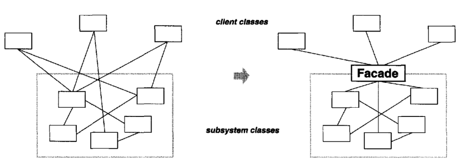
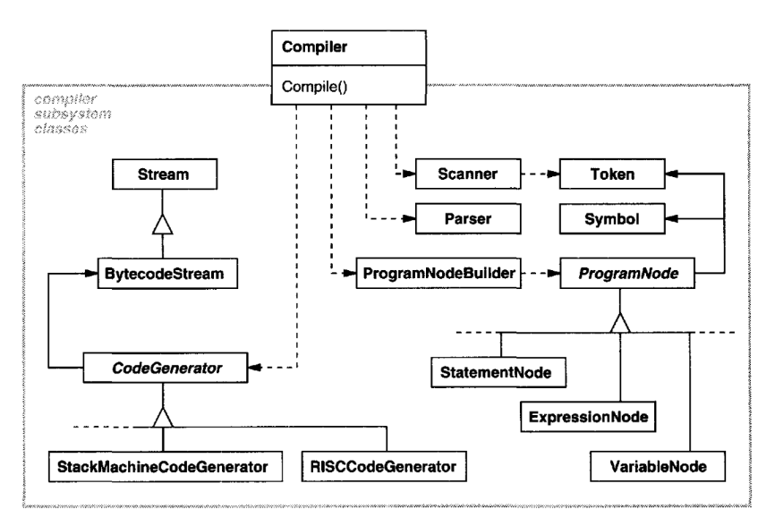
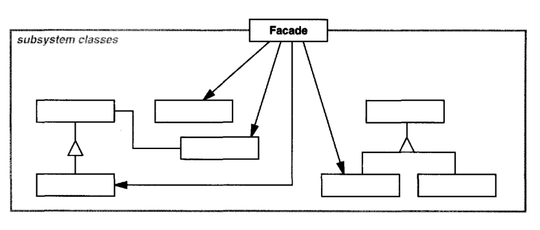

# Facade

## Intent

Provide a unified interface to a set of interfaces in a subsystem. Facade defines a
higher-level interface that makes the subsystem easier to use.

## Motivation

Structuring a system into subsystems helps reduce complexity.A common design
goal is to minimize the communication and dependencies between subsystems.
One way to achieve this goal is to introduce a facade object that provides a single,
simplified interface to the more general facilities of a subsystem.

Consider for example a programming environment that gives applications access
to its compiler subsystem. This subsystem contains classes such as Scanner, Parser,
ProgramNode, BytecodeStream, and ProgramNodeBuilder that implement the
compiler. Some specialized applications might need to access these classes directly.
But most clients of a compiler generally don't care about details like parsing and
code generation; they merely want to compile some code. For them, the powerful
but low-level interfaces in the compiler subsystem only complicate their task.

To provide a higher-level interface that can shield clients from these classes, the
compiler subsystem also includes a Compiler class. This class defines a unified
interface to the compiler's functionality. The Compiler class acts as a facade: It
offers clients a single, simple interface to the compiler subsystem. It glues together
the classes that implement compiler functionality without hiding them completely.
The compiler facade makes life easier for most programmers without hiding the
lower-level functionality from the few that need it.

## Applicability

Use the Facade pattern when
* you want to provide a simple interface to a complex subsystem. Subsystems
often get more complex as they evolve. Most patterns, when applied, result
in more and smaller classes. This makes the subsystem more reusable and
easier to customize, but it also becomes harder to use for clients that don't
need to customize it. A facade can provide a simple default view of the
subsystem that is good enough for most clients. Only clients needing more
customizability will need to look beyond the facade.
* there are many dependencies between clients and the implementation classes
of an abstraction.Introduce a facade to decouple the subsystem from clients
and other subsystems, thereby promoting subsystem independence and
portability.
* you want to layer your subsystems. Use a facade to define an entry point to
each subsystem level. If subsystems are dependent, then you can simplify
the dependencies between them by making them communicate with each
other solely through their facades.

## Structure

