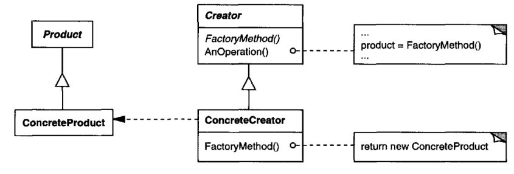

# Factory Method

## Intent

Define an interface for creating an object, but let subclasses decide which class to
instantiate. Factory Method lets a class defer instantiation to subclasses.

## Also Known As

Virtual Constructor

## Motivation

Frameworks use abstract classes to define and maintain relationships between
objects. A framework is often responsible for creating these objects as well.

Consider a framework for applications that can present multiple documents to
the user. Two key abstractions in this framework are the classes Application and
Document. Both classes are abstract, and clients have to subclass them to realize
their application-specific implementations. To create a drawing application, for
example,we define the classes DrawingApplication and DrawingDocument.The
Application class is responsible for managing Documents and will create them as
required—when the user selects Open or New from a menu, for example.

Because the particular Document subclass to instantiate is application-specific,the
Application class can't predict the subclass of Document to instantiate—the Application 
class only knows when a new document should be created, not what kind
of Document to create. This creates a dilemma: The framework must instantiate
classes, but it only knows about abstract classes, which it cannot instantiate.

The Factory Method pattern offers a solution. It encapsulates the knowledge
of which Document subclass to create and moves this knowledge out of the
framework.

Application subclasses redefine an abstract CreateDocument operation on Application 
to return the appropriate Document subclass. Once an Application subclass 
is instantiated, it can then instantiate application-specific Documents without 
knowing their class. We call CreateDocument a factory method because it's
responsible for "manufacturing" an object.

## Applicability

Use the Factory Method pattern when
* a class can't anticipate the class of objects it must create.
* a class wants its subclasses to specify the objects it creates.
* classes delegate responsibility to one of several helper subclasses, and you
want to localize the knowledge of which helper subclass is the delegate.

## Structure

