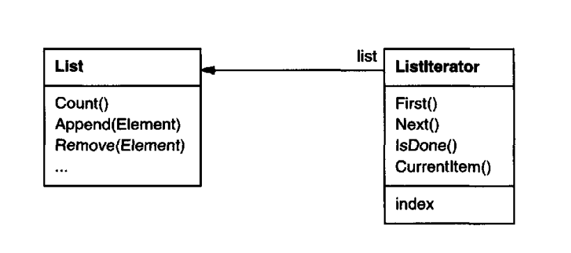
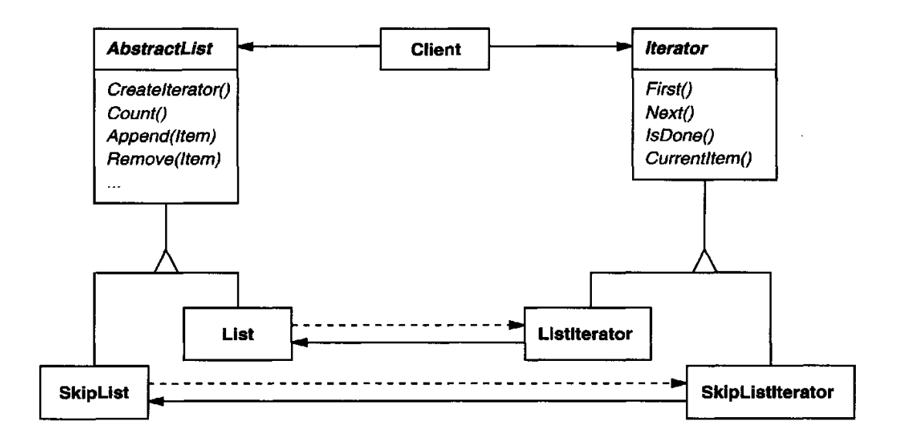
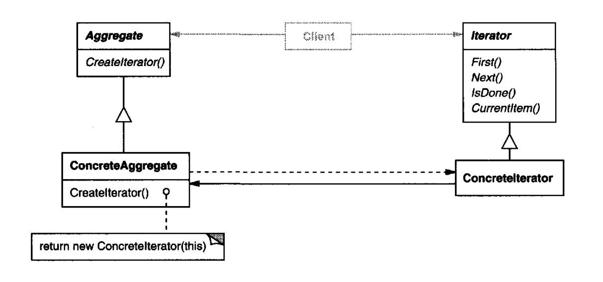

# Iterator

## Intent

Provide a way to access the elements of an aggregate object sequentially without
exposing its underlying representation.

## Also Known As

Cursor

## Motivation

An aggregate object such as a list should give you a way to access its elements
without exposing its internal structure. Moreover, you might want to traverse the
list in different ways, depending on what you want to accomplish. But you probably 
don't want to bloat the List interface with operations for different traversals,
even if you could anticipate the ones you will need. You might also need to have
more than one traversal pending on the same list.

The Iterator pattern lets you do all this. The key idea in this pattern is to take the
responsibility for access and traversal out of the list object and put it into an iterator
object. The Iterator class defines an interface for accessing the list's elements. An
iterator object is responsible for keeping track of the current element; that is, it
knows which elements have been traversed already.

For example, a List class would call for a Listlterator with the following relationship between them:

Before you can instantiate Listlterator, you must supply the List to traverse. Once
you have the Listlterator instance, you can access the list's elements sequentially.
The Currentltem operation returns the current element in the list, First initializes
the current element to the first element, Next advances the current element to
the next element, and IsDone tests whether we've advanced beyond the last
element—that is, we're finished with the traversal.

Separating the traversal mechanism from the List object lets us define iterators
for different traversal policies without enumerating them in the List interface. For
example, FilteringListlterator might provide access only to those elements that
satisfy specific filtering constraints.

Notice that the iterator and the list are coupled, and the client must know that
it is a list that's traversed as opposed to some other aggregate structure. Hence
the client commits to a particular aggregate structure. It would be better if we
could change the aggregate class without changing client code. We can do this by
generalizing the iterator concept to support polymorphic iteration.

As an example, let's assume that we also have a SkipList implementation of a
list. A skiplist is a probabilistic data structure with characteristics similar
to balanced trees. We want to be able to write code that works for both List and
SkipList objects.

We define an AbstractListclassthat provides a common interface for manipulating
lists. Similarly, we need an abstract Iterator class that defines a common iteration
interface. Then we can define concrete Iterator subclasses for the different list
implementations. As a result, the iteration mechanism becomes independent of
concrete aggregate classes.

The remaining problem is how to create the iterator. Since we want to write code
that's independent of the concrete List subclasses, we cannot simply instantiate
a specific class. Instead, we make the list objects responsible for creating their
corresponding iterator. This requires an operation like Createlterator through
which clients request an iterator object.

Createlterator is an example of a factory method. We
use it here to let a client ask a list object for the appropriate iterator. The Factory
Method approach give rise to two class hierarchies, one for lists and another for
iterators. The Createlterator factory method "connects" the two hierarchies.

## Applicability

Use the Iterator pattern

* to access an aggregate object's contents without exposing its internal representation.
* to support multiple traversals of aggregate objects.
* to provide a uniform interface for traversing different aggregate structures
(that is, to support polymorphic iteration).

## Structure

