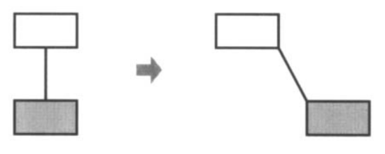
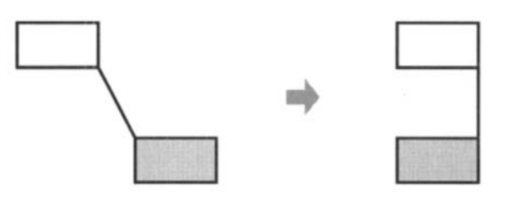
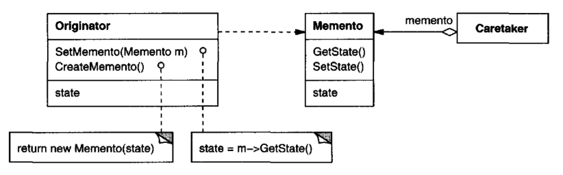

# Memento

## Intent

Without violating encapsulation, capture and externalize an object's internal state
so that the object can be restored to this state later.

## Also Known As

Token

## Motivation

Sometimes it's necessary to record the internal state of an object. This is required
when implementing checkpoints and undo mechanisms that let users back out of
tentative operations or recover from errors. You must save state information 
somewhere so that you can restore objects to their previous states. But objects normally
encapsulate some or all of their state, making it inaccessible to other objects and
impossible to save externally. Exposing this state would violate encapsulation,
which can compromise the application's reliability and extensibility.

Consider for example a graphical editor that supports connectivity between 
objects. A user can connect two rectangles with a line, and the rectangles stay 
connected when the user moves either of them. The editor ensures that the line
stretches to maintain the connection.

A well-known way to maintain connectivity relationships between objects is with
a constraint-solving system. We can encapsulate this functionality in a ConstraintSolver 
object. ConstraintSolver records connections as they are made and generates 
mathematical equations that describe them. It solves these equations whenever 
the user makes a connection or otherwise modifies the diagram. ConstraintSolver 
uses the results of its calculations to rearrange the graphics so that they
maintain the proper connections.

Supporting undo in this application isn't as easy as it may seem. An obvious way
to undo a move operation is to store the original distance moved and move the
object back an equivalent distance. However, this does not guarantee all objects
will appear where they did before. Suppose there is some slack in the connection. 
In that case, simply moving the rectangle back to its original location won't
necessarily achieve the desired effect.

In general, the ConstraintSolver's public interface might be insufficient to allow
precise reversal of its effects on other objects. The undo mechanism must work
more closely with ConstraintSolver to reestablish previous state, but we should
also avoid exposing the ConstraintSolver's internals to the undo mechanism.

We can solve this problem with the Memento pattern. A memento is an object
that stores a snapshot of the internal state of another object—the memento's
originator. The undo mechanism will request a memento from the originator
when it needs to checkpoint the originator's state. The originator initializes the
memento with information that characterizes its current state. Only the originator
can store and retrieve information from the memento—the memento is "opaque"
to other objects.

In the graphical editor example just discussed, the ConstraintSolver can act as an
originator. The following sequence of events characterizes the undo process:
1. The editor requests a memento from the ConstraintSolver as a side-effect of
   the move operation.
2. The ConstraintSolver creates and returns a memento, an instance of a class
   SolverState in this case. A SolverState memento contains data structures that
   describe the current state of the ConstraintSolver's internal equations and
   variables.
3. Later when the user undoes the move operation, the editor gives the SolverState 
   back to theConstraintSolver.
4. Based on the information in the SolverState, the ConstraintSolver changes
   its internal structures to return its equations and variables to their exact
   previous state.

This arrangement lets the ConstraintSolver entrust other objects with the information 
it needs to revert to a previous state without exposing its internal structure
and representations.

## Applicability

Use the Memento pattern when
* a snapshot of (some portion of) an object's state must be saved so that it can
be restored to that state later, and
* a direct interface to obtaining the state would expose implementation details
and break the object's encapsulation.

## Structure

