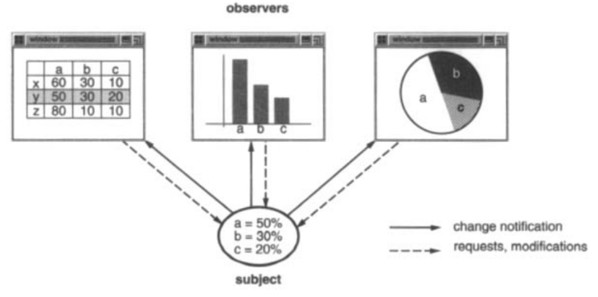
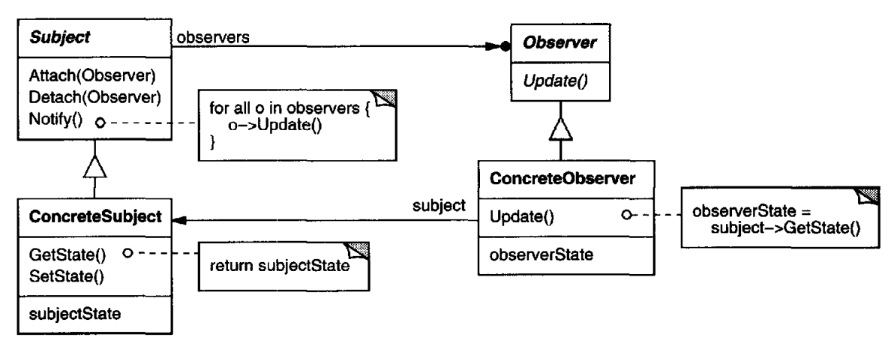

# Observer

## Intent

Define a one-to-many dependency between objects so that when one object
changes state, all its dependents are notified and updated automatically.

## Also Known As

Dependents, Publish-Subscribe

## Motivation

A common side-effect of partitioning a system into a collection of cooperating
classes is the need to maintain consistency between related objects. You don't
want to achieve consistency by making the classes tightly coupled, because that
reduces their reusability.

For example, many graphical user interface toolkits separate the presentational
aspects of the user interface from the underlying application data [KP88, LVC89,
P+ 88, WGM88]. Classes defining application data and presentations can be reused
independently. They can work together, too. Both a spreadsheet object and bar
chart object can depict information in the same application data object using
different presentations.The spreadsheet and the bar chart don't know about each
other, thereby letting you reuse only the one you need. But they behave as though
they do. When the user changes the information in the spreadsheet, the bar chart
reflects the changes immediately, and vice versa.

This behavior implies that the spreadsheet and bar chart are dependent on the
data object and therefore should be notified of any change in its state. And there's
no reason to limit the number of dependent objects to two; there may be any
number of different user interfaces to the same data.

The Observer pattern describes how to establish these relationships. The key
objects in this pattern are subject and observer. A subject may have any number
of dependent observers.All observers are notified whenever the subject undergoes
a change in state.In response, each observer will query the subject to synchronize
its state with the subject's state.

This kind of interaction is also known as publish-subscribe. The subject is the
publisher of notifications. It sends out these notifications without having to know
who its observers are. Any number of observers can subscribe to receive notifications.

## Applicability

Use the Observer pattern in any of the following situations:

* When an abstraction has two aspects, one dependent on the other. Encapsulating 
these aspects in separate objects lets you vary and reuse them independently.
* When a change to one object requires changing others, and you don't know
how many objects need to be changed.
* When an object should be able to notify other objects without making 
assumptions about who these objects are.In other words, you don't want these
objects tightly coupled.

## Structure

