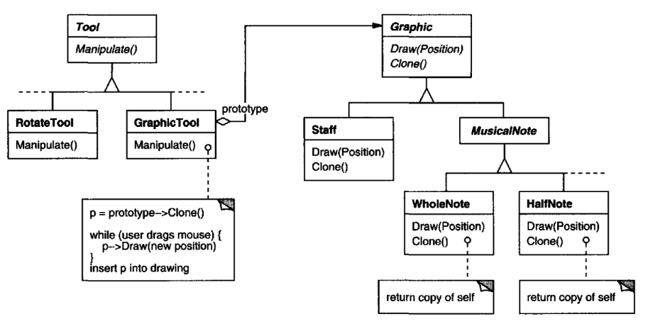
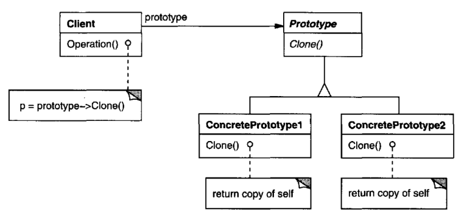

# Prototype

## Intent

Specify the kinds of objects to create using a prototypical instance, and create new
objects by copying this prototype.

## Motivation

You could build an editor for music scores by customizing a general framework
for graphical editors and adding new objects that represent notes, rests, and
staves. The editor framework may have a palette of tools for adding these music
objects to the score. The palette would also include tools for selecting, moving,
and otherwise manipulating music objects. Users will click on the quarter-note
tool and use it to add quarter notes to the score. Or they can use the move tool to
move a note up or down on the staff, thereby changing its pitch.

Let's assume the framework provides an abstract Graphic class for graphical components, 
like notes and staves. Moreover, it'll provide an abstract Tool class for
defining tools like those in the palette. The framework also predefines a Graphic-Tool 
subclass for tools that create instances of graphical objects and add them to
the document.

But Graphic-Tool presents a problem to the framework designer. The classes for
notes and staves are specific to our application, but the GraphicTool class belongs
to the framework. Graphic-Tool doesn't know how to create instances of our music
classes to add to the score. We could subclass Graphic-Tool for each kind of music
object, but that would produce lots of subclasses that differ only in the kind of
music object they instantiate. We know object composition is a flexible alternative
to subclassing. The question is, how can the framework use it to parameterize
instances of GraphicTool by the class of Graphic they're supposed to create?

The solution lies in making GraphicTool create a new Graphic by copying or
"cloning" an instance of a Graphic subclass. We call this instance a prototype.
GraphicTool is parameterized by the prototype it should clone and add to the
document. If all Graphic subclasses support a Clone operation, then the GraphicTool 
can clone any kind of Graphic.

So in our music editor, each tool for creating a music object is an instance of
GraphicTool that's initialized with a different prototype. Each GraphicTool instance 
will produce a music object by cloning its prototype and adding the clone
to the score.

We can use the Prototype pattern to reduce the number of classes even further.
We have separate classes for whole notes and half notes, but that's probably
unnecessary. Instead they could be instances of the same class initialized with
different bitmaps and durations. A tool for creating whole notes becomes just a
GraphicTool whose prototype is a MusicalNote initialized tobe a whole note. This
can reduce the number of classes in the system dramatically.It also makes it easier
to add a new kind of note to the music editor.

## Applicability

Use the Prototype pattern when a system should be independent of how its
products are created, composed, and represented; and
* when the classes to instantiate are specified at run-time, for example, by
dynamic loading; or
* to avoid building a class hierarchy of factories that parallels the class hierarchy 
of products; or
* when instances of a class can have one of only a few different combinations
of state. It may be more convenient to install a corresponding number of
prototypes and clone them rather than instantiating the class manually, each
time with the appropriate state.

## Structure

