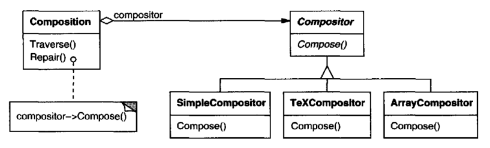
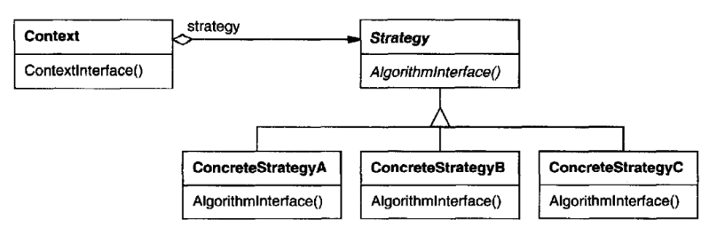

# Strategy

## Intent

Define a family of algorithms, encapsulate each one, and make them interchangeable. 
Strategy lets the algorithm vary independently from clients that use it.

## Also Known As

Policy

## Motivation

Many algorithms exist for breaking a stream of text in to lines. Hard-wiring all such
algorithms into the classes that require them isn't desirable for several reasons:

* Clients that need line-breaking get more complex if they include the line-breaking code. 
That makes clients bigger and harder to maintain, especially
if they support multiple line-breaking algorithms.
* Different algorithms will be appropriate at different times. We don't want to
support multiple line breaking algorithms if we don't use them all.
* It's difficult to add new algorithms and vary existing ones when line-breaking
is an integral part of a client.

Suppose a Composition class is responsible for maintaining and updating the
linebreaks of text displayed in a text viewer. Line-breaking strategies aren't implemented 
by the class Composition. Instead, they are implemented separately
by subclasses of the abstract Compositor class. Compositor subclasses implement
different strategies:
* SimpleCompositor implements a simple strategy that determines linebreaks
one at a time.
* TeXCompositor implements the TgX algorithm for finding linebreaks. This
strategy tries to optimize linebreaks globally,that is, one paragraph at a time.
* ArrayCompositor implements a strategy that selects breaks so that each row
has a fixed number of items. It's useful for breaking a collection of icons into
rows, for example.

A Composition maintains a reference to aCompositor object.Whenever a Composition 
reformats its text,it forwards this responsibility to itsCompositor object.The
client of Composition specifies which Compositor should be used by installing
the Compositor it desires into the Composition.

## Applicability

Use the Strategy pattern when
* many related classes differ only in their behavior. Strategies provide a way
to configure a class with one of many behaviors.
* you need different variants of an algorithm. For example, you might define 
algorithms reflecting different space/time trade-offs. Strategies can be
used when these variants are implemented as a class hierarchy of algorithms.
* an algorithm uses data that clients shouldn't know about. Use the Strategy
pattern to avoid exposing complex, algorithm-specific data structures.
* a class defines many behaviors, and these appear as multiple conditional
statements in its operations. Instead of many conditionals, move related
conditional branches into their own Strategy class.

## Structure

